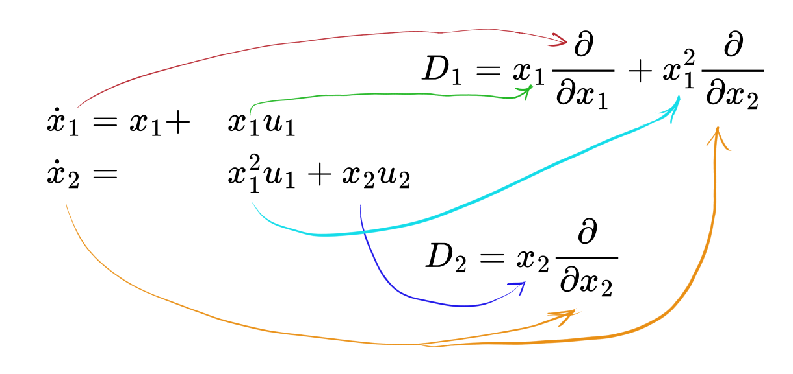

Inputs and Parameters
======================

Differential equations may also contain not only state variables, but also parameters and input functions.
For instance, consider the system:
$$
\begin{array}{l}
x' = c_1 y \cdot u(t) \\
y' = c_2 x^3
\end{array},
$$

where $c_1, c_2 \in \mathbb{C}$ are parameters and $u(t)$ is an unknown input function.

In QBee we introduce them in the following way:

.. code-block:: python

    >>> from qbee import *
    >>> c1, c2 = parameters("c1, c2")
    >>> x, y, u = functions("x, y, u")
    >>> system = [(x, c1*y*u), (y, c2*x**3)]  # u is considered as input since it's not in the left-hand side;
    >>> quadratize(system).print()
    Introduced variables:
    w0 = x**2
    w1 = x*y
    w2 = y**2

    x' = c1*u*y
    y' = c2*w0*x
    w0' = 2*c1*u*w1
    w1' = c1*u*w2 + c2*w0**2
    w2' = 2*c2*w0*w1

Inputs' Derivatives
--------------------------

Note that we can introduce a derivative of an input function during quadratization.
Let's look at this with an example:
$$
\begin{array}{ll}
x' = y^2 u(t) \\
y' = x^2
\end{array}
$$

.. code-block:: python

    >>> from qbee import *
    >>> x, y, u = functions("x, y, u")
    >>> system = [(x, y**2 * u), (y, x**2)]
    >>> quadratize(system).print()
    Introduced variables:
    w0 = u*y
    w1 = u*x

    x' = w0*y
    y' = x**2
    w0' = u'*y + w1*x
    w1' = u'*x + w0**2

It should be mentioned that sometimes the derivatives of the input functions are unknown or do not even exist!
To cover such cases, we can try to find an *input-free quadratization*,
i.e. quadratization contains no input functions and therefore does not introduce their derivatives.

.. code-block:: python

    >>> from qbee import *
    >>> x, y, u = functions("x, y, u")
    >>> system = [(x, y**2 * u), (y, x**2)]
    >>> quadratize(system, input_free=True).print()
    Introduced variables:
    w0 = y**2
    w1 = x**2
    w2 = x*y**2
    w3 = x*y
    w4 = y**3
    w5 = y**4

    x' = u*w0
    y' = w1
    w0' = 2*w1*y
    w1' = 2*u*w2
    w2' = u*w5 + 2*w1*w3
    w3' = u*w4 + w1*x
    w4' = 3*w3**2
    w5' = 4*w2*w3

It is clear that the order of quadratization in the input-free case has increased significantly.
This is not accidental: such quadratizations are indeed larger and do not even always exist!

Existence of input-free quadratizations
---------------------------------------------------------

The existence from problem of input-free quadratization is thoroughly discussed in Section 3.2 of
`Exact and optimal quadratization of nonlinear finite-dimensional non-autonomous dynamical systems <https://doi.org/10.48550/arXiv.2303.10285>`_ .
Here, however, we will only give our results and helpful practices.

Consider original system to be input-affine, that is, of the form
$$
\mathbf{\dot{x}} = \mathbf{p_0}(\mathbf{x}) + \sum_{i=1}^r \mathbf{p_i}(\mathbf{x}) u_i. \tag{1}
$$

**Theorem 1**: if the system (1) is also a polynomial-bilinear, that is, the total degree of $\mathbf{p_i}(\mathbf{x})$
is at most one for every $1 \le i \le r$, then there is an input-free quadratization.

It turns out that the existence of input-free quadratization can be characterized via
the properties of certain linear differential operators associated with inputs $\mathbf{u}(t)$.

**Definition 1**: We introduce $r$ differential operators for the system (1):
$$
D_i := \mathbf{p_i}(\mathbf{x})^T \cdot \frac{\partial}{\partial \mathbf{x}}, \quad 1 \le i \le r,
$$
where $\frac{\partial}{\partial \mathbf{x}} = \Big[ \frac{\partial}{\partial x_1},\dots \frac{\partial}{\partial x_N} \Big]^T$

It is easier to imagine with an **example**. Consider the following system:
$$
\begin{array}{l}
\mathbf{\dot{x_1}} = x_1 + x_1 y_1 \\
\mathbf{\dot{x_2}} = x_1^2 u_1 + x_2 u_2
\end{array}.
$$

Then we introduce two differential operators $D_1$ and $D_2$, associated with $u_1$ and $u_2$ accordingly:

$$
D_1 = [x_1, x_1^2] \cdot [\frac{\partial}{\partial x_1}, \frac{\partial}{\partial x_2}]
$$
and
$$
D_2 = [0, x_2] \cdot [\frac{\partial}{\partial x_1}, \frac{\partial}{\partial x_2}].
$$

Below you can see how we build up these operators more visually:

**Theorem 2**: Let $\mathcal{A}$ be a subalgebrra generated by $D_1,\dots, D_r$ in the algebra
$\mathbb{C}[\mathbf{x}, \mathbf{\frac{\partial}{\partial x}}]$ of all polynomial
differential operators in $\mathbf{x}$.
Then there is an input-free quadratization of (1) if and only if
$$
dim\{ A(x_i)\ | \ A \in \mathcal{A}\} < \infty \quad \textit{for every } 1 \le i \le N.
$$

Let's use the example above to show how the theorem works.

For $x_1$ we have
$$
\begin{gather*}
D_1(x_1) = x_1, \quad D_2(x_1) = 0   \\ \Downarrow \\
\{A(x_1)\ | \ A \in \mathcal(A)\} = \text{span}\{x_1\}
\end{gather*}
$$

For $x_2$ we have
$$
\begin{gather*}
D_1(x_2) = x_1^2, \quad D_1^2(x_2) = D_1(x_1^2) = 2x_1^2,\quad D_2(x_2) = x_2\\
\Downarrow \\
\{A(x_2)\ | \ A \in \mathcal(A)\} = \text{span}\{x_2, x_1^2\}
\end{gather*}
$$

Therefore, Theorem 2 implies that the example system has an input-free quadratization.
And indeed:

.. code-block:: python

    >>> x1, x2, u1, u2 = functions("x1, x2, u1, u2")
    >>> system = [(x1, x1 + x1 * u1), (x2, x1**2 * u1 + x2 * u2)]
    >>> quadratize(system, input_free=True).print()
    Introduced variables:
    w0 = x1**2

    x1' = u1*x1 + x1
    x2' = u1*w0 + u2*x2
    w0' = 2*u1*w0 + 2*w0

Now consider an **example** where there is no input-free quadratization.
$$
\dot x = x^2 u
$$

Associated differential operator is $D = x^2 \frac{\partial}{\partial x}$ and the algebra $\mathcal{A}$
spanned by
$$
D(x) = x^2,\quad D^2(x) = D(x^2) = 2x^3,\quad D^3(x) = 6x^4, \dots
$$
has infinite dimension. Thus, there is no input-free quadratization exists.

.. code-block:: python

    >>> x, u = functions("x, u")
    >>> system = [(x, x**2 * u)]
    >>> upper_bound = partial(pruning_by_vars_number, nvars=100)  # Max quadratization order = 100
    >>> res = quadratize(system, input_free=True, pruning_functions=[upper_bound, *default_pruning_rules])
    >>> print(res)
    None

.. collapse:: Why Theorem 2 is not in QBee yet

    The problem is that a complete algorithm for solving this kind of problem
    has not yet been found in the general case (See **Remark 3.10** of the article above).
    For the input-free quadratization problem specifically, there is some progress,
    but we have not yet been able to fully prove the correctness of the proposed algorithm.

|

Setting up possible derivatives of inputs
----------------------------------------------------

Sometimes there are cases where input-free quadratizations are not required
and you know exactly how many derivatives your input functions have.

You can use the ``input_ders_order`` parameter to denote
the maximum allowed order of derivatives for input functions.

.. code-block:: python

    >>> x, y, u, v = functions("x, y, u, v")
    >>> system = [(x, y**2 * u), (y, v * x**2)]
    >>> quadratize(system, input_der_orders={v: 2, u: 0}).print()  # v' and v'' are allowed
    Introduced variables:
    w0 = y**2
    w1 = v*x
    w2 = v*y**2
    w3 = v*x*y
    w4 = v'*x
    w5 = v'*y**2
    w6 = v*x**2
    w7 = v*y**3
    w8 = v*x*y**2
    w9 = v*y**4

    x' = u*w0
    y' = w6
    w0' = 2*w6*y
    w1' = u*w2 + w4
    w2' = 2*w1*w3 + w5
    w3' = u*w7 + w1*w6 + w4*y
    w4' = u*w5 + v''*x
    w5' = v''*w0 + 2*w3*w4
    w6' = 2*u*w8 + w4*x
    w7' = 3*w3**2 + w5*y
    w8' = u*w9 + w0*w4 + 2*w3*w6
    w9' = w0*w5 + 4*w6*w7